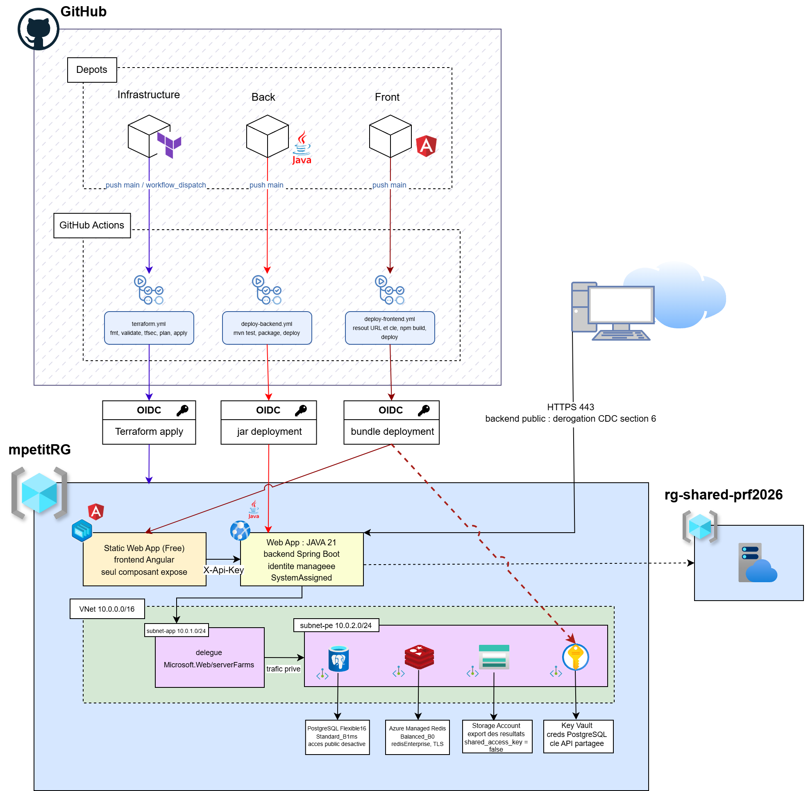

# simplon-quiz-infrastructure-bilan

Terraform infrastructure for the non-production environment of the Simplon quiz app on Azure.



## Stack

App Service (backend), Static Web Apps (frontend), PostgreSQL Flexible Server, Azure Managed
Redis, Storage Account, Key Vault. All in `mpetitRG`, on an App Service Plan of its own.

The promotion's shared plan `plan-npr-prf2026` was the intended host, but an App Service plan
accepts exactly two VNet integrations, one virtual interface each on its workers, and both were
taken. That limit belongs to the hardware rather than to the pricing tier, so scaling the shared
plan up would not have made room.

## Running it

Deployments go through the `terraform` workflow. A local run is for reading a plan, and takes two
steps because Terraform reads the vault's secrets over the data plane, which its firewall filters:

```sh
scripts/keyvault-firewall.sh add
terraform plan
scripts/keyvault-firewall.sh remove
```

The allowed address is not part of the desired state. A runner gets a new one on every run, and
describing the list in the configuration deadlocks the refresh: Terraform would have to read the
secrets before it could grant itself the right to read them. The pipeline runs the same two steps
around its own.

Reading a plan locally also needs the `Key Vault Secrets Officer` role on the vault. The pipeline's
identity grants it to itself; a person has to be granted it.

The storage account needs none of this: it is closed to the internet altogether, its container
being created over the Resource Manager API, and the provider is told so with
`data_plane_available = false`.

The database server, the storage account and its container, the vault and its secrets carry
`prevent_destroy`. Terraform refuses to delete them, and refuses any change that would recreate
them. Tearing the environment down therefore starts by removing those blocks, deliberately, in a
commit of its own.

## Branches

- `main`: deployed to Azure
- `develop`: integration
- `feature/*`: one per change, merged into `develop` via pull request
