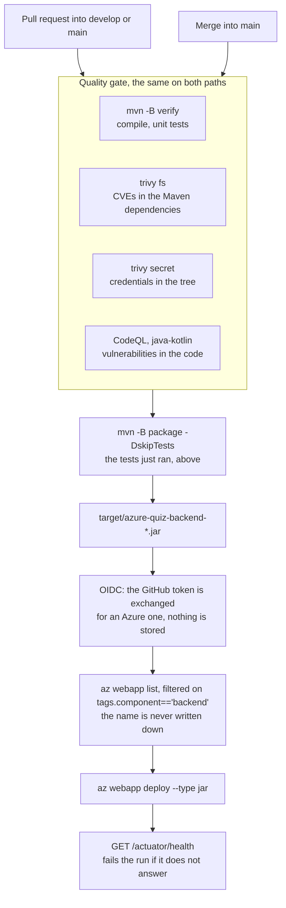
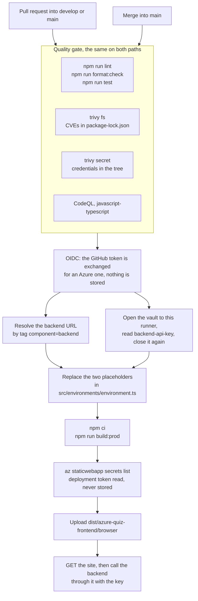

# Deployment pipelines

How the two applications reach the infrastructure this repository describes. Drawn before the
workflows were written, so that what each one is responsible for was settled first.

Three repositories, three pipelines. This one applies Terraform; the other two deploy code onto
what Terraform created. None of them holds a long lived secret, and none of them names an Azure
resource: every pipeline asks Azure for its target by tag.

## Backend, into App Service

The web app already carries every setting it needs: Terraform wrote them, three of them as Key
Vault references. The pipeline ships a jar and nothing else.

## Frontend, into Static Web Apps

A static site has no runtime, so what a server would read from the environment has to be baked into
the build. That is the whole reason this pipeline is longer than the backend's.

## The gate, and why it sits on both paths

Nothing reaches Azure without passing it. Running these checks only on pull requests would leave
the one path that actually deploys unverified, and a merge is not a rerun of the branch it came
from: a semantic conflict compiles on both sides and fails once joined. This repository already
gates its own `plan` and `apply` the same way.

Four checks, answering four different questions:

| Check | Question |
| --- | --- |
| `mvn verify` / `npm run lint`, `test` | does it still build and behave |
| `trivy fs` | is a dependency known to be vulnerable |
| `trivy secret` | did a credential get committed |
| CodeQL | does the code itself contain a known vulnerable pattern |

CodeQL is free here because all three repositories are public. GitHub's own secret scanning and
push protection are enabled on top, at the platform level: they refuse a credential at push time,
which is earlier than any pipeline can act, but only for the patterns GitHub recognises. The two
overlap without replacing each other.

## What holds it together

**No stored credentials.** Each repository has its own federated credential on the same app
registration, so GitHub proves who it is and Azure hands back a token that expires with the job.
A leaked repository yields nothing reusable.

**No resource names in the pipelines.** Every target is found by its `component` tag. Renaming a
resource, or rebuilding the environment under different names, leaves the workflows untouched.
This is what the `component` tag on each Terraform resource exists for.

**The vault stays shut.** Reading `backend-api-key` goes through the data plane, which the vault
firewall filters, so the frontend pipeline opens the door for its own address and closes it after,
the same way this repository's own pipeline does.

**Secrets end up in the frontend bundle.** The API key is compiled into JavaScript any visitor can
read. That is a property of static hosting, not an accident of this pipeline: it identifies the
frontend to the backend, it does not authenticate a user. It is written up as such in the ADR, with
the CORS origin that goes with it.

## What has to exist first

- A federated credential per repository on the `github-oidc-simplon-quiz-bilan` app registration.
  `scripts/bootstrap-oidc.sh` creates them for this repository only, so far.
- `Key Vault Secrets User` for that identity, to read the API key.
- The `nonprod` environment on each repository, so that a deployment is a reviewable event rather
  than a side effect of a merge.
